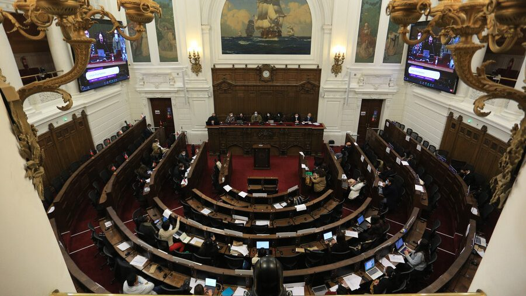
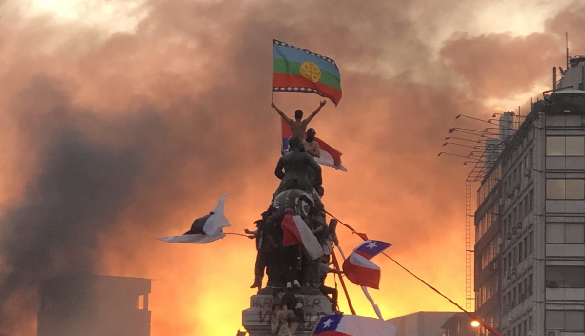
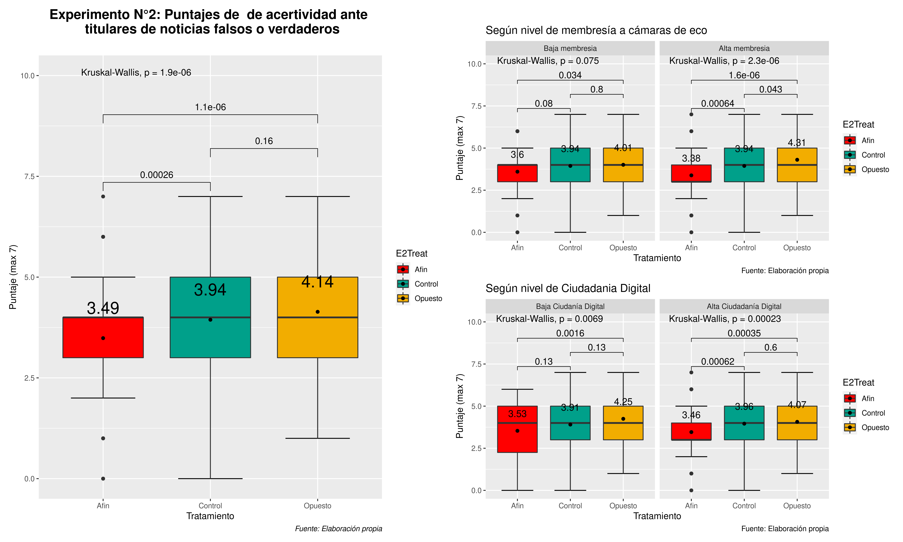

```{r setup, include=FALSE}
options(htmltools.dir.version = FALSE)
```
```{r xaringan-themer, include=FALSE, warning=FALSE, echo=FALSE, message=FALSE}
library(xaringanthemer)
style_mono_accent(
  base_color = "#23395b",
  header_font_google = google_font("Josefin Sans"),
  text_font_google   = google_font("Montserrat", "300", "300i"),
  code_font_google   = google_font("Fira Mono")
)
style_mono_light(base_color = "#23395b")
```
```{r, warning=FALSE, message=FALSE, echo=FALSE}
remotes::install_github("jhelvy/xaringanBuilder")
remotes::install_github('rstudio/chromote')

pacman::p_load(cowplot, ggplot2, tidyverse, dplyr, patchwork, kableExtra, MASS, ggpubr, fastDummies, xaringanBuilder)
```

background-image: url(https://complejidadsocial.udd.cl/wp-content/themes/cics/images/backgrounds/logo2017a.png)
background-size: 140px
background-position: 90% 8%
class: center, middle

# ¿Can we identify fake or real news if are related to our opinion?

[Poner fotos de los procesos políticos que se han ocurrido en Chile y la batalla por la información que la apareja]



---
class: center, middle
### How does membership in echo chambers and digital citizenship affect our scores distinguishing fake news from real news?

---
background-image: url(https://complejidadsocial.udd.cl/wp-content/themes/cics/images/backgrounds/logo2017a.png)
background-size: 140px
background-position: 90% 8%
class: left, middle

.pull-left[

# ¿What do we know about the relationship beetween echo chambers and misinformation?

]

.pull-right[

- **Information bias**: endemic consumption of information that is politically similar to one's own thinking and the distancing, rejection or impossibility of consuming information of different political thinking.

- **Spread of disinformation**: those who belong to echo chambers spread information faster, generate rumors and reach audiences that do not directly exceed those rumors.

]


---
background-image: url(https://complejidadsocial.udd.cl/wp-content/themes/cics/images/backgrounds/logo2017a.png)
background-size: 140px
background-position: 90% 8%
class: left, top


## Hypothesis

#### 1)There will be less accuracy in rating fake and real news when it comes to rating political opposite's view news headlines over like-minded news headlines or control group.


##### 1.a)Those who have a high level of echo chamber membership will not exhibit greater differences in the headline hit rate between like-minded and contrarian thinking, compared to the control group.

##### 1.b)Those with higher levels of digital citizenship will have greater accuracy in rating false and true headlines in all conditions


---
background-image: url(https://complejidadsocial.udd.cl/wp-content/themes/cics/images/backgrounds/logo2017a.png)
background-size: 140px
background-position: 90% 8%
class:left, middle

# Methods

.pull-left[

**Sample**

**Randomization**

**Experimental survey**

]

.pull-right[

- 690 participant in a survey experiment from CESS Santiago de Chile's poll.

- Block randomization with Eco Chamber membership and levels of digital citizenship (both binaries: 1 = Hight Eco Chamber membership; 1 = High Digital Citizenship levels)

- We showed to participants 7 different news headlines, and asked them to rate them as true or false. We have three experimental conditions

- We also ask about gender, income, education and age range

]

---
background-image: url(https://complejidadsocial.udd.cl/wp-content/themes/cics/images/backgrounds/logo2017a.png)
background-size: 140px
background-position: 90% 8%
class: center, middle

## Results


---


---
background-image: url(https://complejidadsocial.udd.cl/wp-content/themes/cics/images/backgrounds/logo2017a.png)
background-size: 140px
background-position: 90% 8%
class: center, left, top

## Discussion

- 
- Motivated skepticism (Taber & Lodge, 2006)
 
---
class: inversed, center, middle

# ¡Thank You!

Slide created by [**xaringan**](https://github.com/yihui/xaringan) package.


El  chakra viene de [remark.js](https://remarkjs.com), [**knitr**](https://yihui.org/knitr/), y [R Markdown](https://rmarkdown.rstudio.com).


```{r, echo=FALSE, warning=FALSE, message=FALSE}


p1 <- ggdraw() + draw_image("https://user-images.githubusercontent.com/163582/45438104-ea200600-b67b-11e8-80fa-d9f2a99a03b0.png", scale = 0.3)
p2 <- ggdraw() + draw_image("https://pkg.garrickadenbuie.com/xaringanthemer/logo.png", scale = 0.3)

plot_grid(p1, p2)
```

```{r, echo=FALSE, message=FALSE, warning=FALSE}
library(xaringanBuilder)
build_pdf("beamer_presentation/beamer_presentation.Rmd")

```


