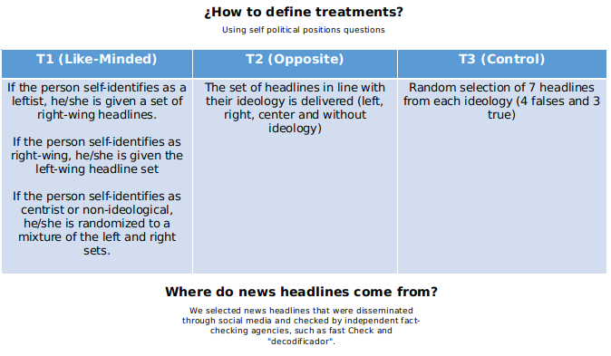
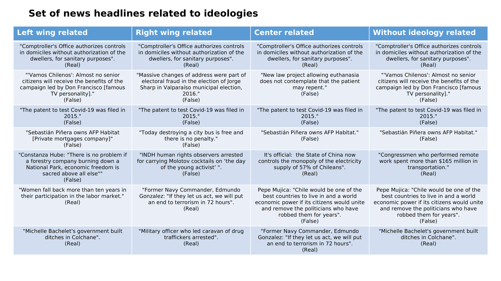
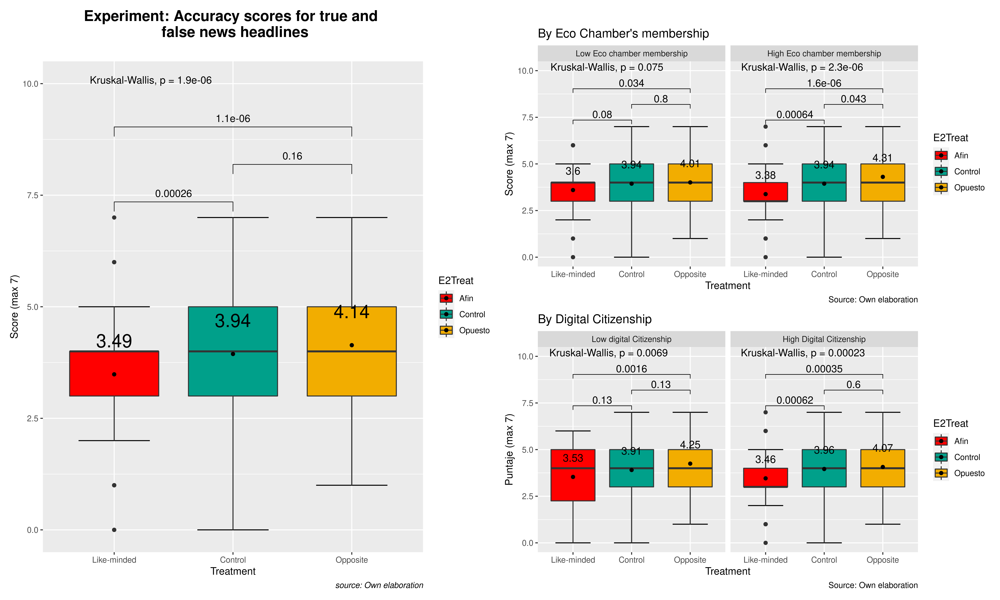
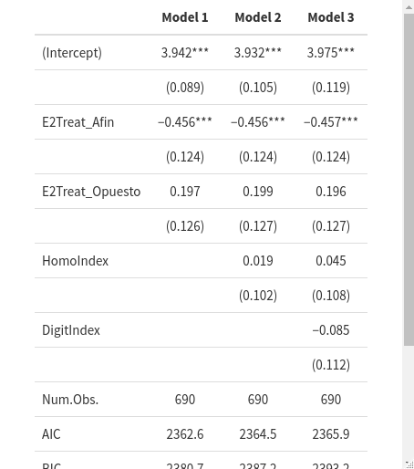

```{r setup, include=FALSE}
options(htmltools.dir.version = FALSE)
```
```{r xaringan-themer, include=FALSE, warning=FALSE, echo=FALSE, message=FALSE}
library(xaringanthemer)
style_mono_accent(
  base_color = "#23395b",
  header_font_google = google_font("Josefin Sans"),
  text_font_google   = google_font("Montserrat", "300", "300i"),
  code_font_google   = google_font("Fira Mono")
)
style_mono_light(base_color = "#23395b")
```
```{r, warning=FALSE, message=FALSE, echo=FALSE}
remotes::install_github("jhelvy/xaringanBuilder")
remotes::install_github('rstudio/chromote')

pacman::p_load(cowplot, ggplot2, tidyverse, dplyr, patchwork, kableExtra, MASS, ggpubr, fastDummies, xaringanBuilder)
```

background-image: url(https://complejidadsocial.udd.cl/wp-content/themes/cics/images/backgrounds/logo2017a.png)
background-size: 140px
background-position: 90% 8%
class: center, middle

# ¿Can we identify fake or real news if are related to our opinion?


---
class: center, middle

### Main Question

#### How does membership in echo chambers and digital citizenship affect our scores distinguishing fake news from real news?

---
background-image: url(https://complejidadsocial.udd.cl/wp-content/themes/cics/images/backgrounds/logo2017a.png)
background-size: 140px
background-position: 90% 8%
class: left, middle

.pull-left[

# ¿What do we know about the relationship beetween echo chambers and misinformation?

]

.pull-right[

- **Information bias**: endemic consumption of information that is politically similar to one's own thinking and the distancing, rejection or impossibility of consuming information of different political thinking. (Currarini & Mengel, 2016; Halbestam & Knight, 2016)

- **Spread of disinformation**: those who belong to echo chambers spread information faster, generate rumors and reach audiences that do not directly exceed those rumors (Choi et. al. 2020)

]


---
background-image: url(https://complejidadsocial.udd.cl/wp-content/themes/cics/images/backgrounds/logo2017a.png)
background-size: 140px
background-position: 90% 8%
class: left, top


## Hypothesis

#### 1)There will be less accuracy in rating fake and real news when it comes to rating political opposite's view news headlines over like-minded news headlines or control group.


##### 1.a)Those who have a high level of echo chamber membership will not exhibit greater differences in the headline hit rate between like-minded and contrarian thinking, compared to the control group.

##### 1.b)Those with higher levels of digital citizenship will have greater accuracy in rating false and true headlines in all conditions


---
background-image: url(https://complejidadsocial.udd.cl/wp-content/themes/cics/images/backgrounds/logo2017a.png)
background-size: 140px
background-position: 90% 8%
class:left, middle

# Methods

.pull-left[

**Sample**

**Randomization**

**Experimental survey**

]

.pull-right[

- 690 participant in a survey experiment from CESS Santiago de Chile's poll.

- Block randomization with Eco Chamber membership and levels of digital citizenship (both binaries: 1 = Hight Eco Chamber membership; 1 = High Digital Citizenship levels)

- We showed to participants 7 different news headlines, and asked them to rate them as true or false. We have three experimental conditions

- We also ask about gender, income, education, Ideology and age range

]
---
class: center, middle




---
class: center, middle




---
background-image: url(https://complejidadsocial.udd.cl/wp-content/themes/cics/images/backgrounds/logo2017a.png)
background-size: 140px
background-position: 90% 8%
class: center, middle

## Results


---



---
background-image: url(https://complejidadsocial.udd.cl/wp-content/themes/cics/images/backgrounds/logo2017a.png)
background-size: 140px
background-position: 90% 8%
class:left, top

## Discussion

- We find Evidence to intra-group biased new's consumption, supporting by others studies (eg: Osmundsen et.al, 2021; Pereira et.al, 2021)

- *Motivated skepticism* (Taber & Lodge, 2006). Motivated Excepticism is a concept used to describe the process by which people pay more attention to and are better informed about content that is opposed to their thinking, so as to be able to debate more fiercely with them.

- Researchers who had not considered this concept come to the same finding (eg. Allen et.al, 2021; Pennycook & Rand, 2019), and so do we.

---
background-image: url(https://complejidadsocial.udd.cl/wp-content/themes/cics/images/backgrounds/logo2017a.png)
background-size: 140px
background-position: 90% 8%
class:left, middle

- This is the first step to understand the trench warfare that has been taking place in Chile since the social mobilizations of October 2019. Biased information indicates limited deliberation and increased intolerance.

- invites us to look at political polarization from another perspective: is it a matter of exaggerating the other, or of overestimating our own position?
---
class: inversed, center, middle
background-image: url(https://user-images.githubusercontent.com/163582/45438104-ea200600-b67b-11e8-80fa-d9f2a99a03b0.png)
background-size: 80px
background-position: 50% 80%

# ¡Thank You!

This Slide has created with [**xaringan**](https://github.com/yihui/xaringan), [**XaringanThemer**](https://pkg.garrickadenbuie.com/xaringanthemer/index.html) and [**XaringanBuilder**](https://github.com/jhelvy/xaringanBuilder) packages.

---
class: inverted, center, middle

# Appendix


---

**References:**

- Allen, J. N. L., Martel, C., & Rand, D. G. (2021). Birds of a feather don’t fact-check each other: Partisanship and the evaluation of news in Twitter’s Birdwatch crowdsourced fact-checking program [Preprint].

- Bago, B., Rand, D. G., & Pennycook, G. (2020). Fake news, fast and slow: Deliberation reduces belief in false (but not true) news headlines. Journal of Experimental Psychology: General, 149(8), 1608-1613. 

- Choi, D., Chun, S., Oh, H., Han, J., & Kwon, T. “Taekyoung”. (2020). Rumor Propagation is Amplified by Echo Chambers in Social Media. Scientific Reports, 10(1), 310.

- Currarini, S., & Mengel, F. (2016). Identity, homophily and in-group bias. European Economic Review, 90, 40-55. 

- Fu, G., & Zhang, W. (2016). Opinion formation and bi-polarization with biased assimilation and homophily. Physica A: Statistical Mechanics and Its Applications, 444, 700-712.

---

- Halberstam, Y., & Knight, B. (2016). Homophily, group size, and the diffusion of political information in social networks: Evidence from Twitter. Journal of Public Economics, 143, 73-88. 

- Osmundsen, M., Bor, A., Vahlstrup, P. B., Bechmann, A., & Petersen, M. B. (2021). Partisan Polarization Is the Primary Psychological Motivation behind Political Fake News Sharing on Twitter. American Political Science Review, 115(3), 999-1015. 

- Pennycook, G., & Rand, D. G. (2019). Lazy, not biased: Susceptibility to partisan fake news is better explained by lack of reasoning than by motivated reasoning. Cognition, 188, 39-50.

- Pereira, A., Harris, E., & Van Bavel, J. J. (2021). Identity concerns drive belief: The impact of partisan identity on the belief and dissemination of true and false news. Group Processes & Intergroup Relations.

- Taber, C. S., & Lodge, M. (2006). Motivated Skepticism in the Evaluation of Political Beliefs. American Journal of Political Science, 50(3), 755-769.

---


