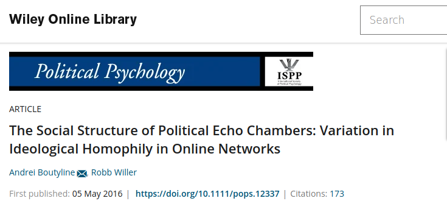
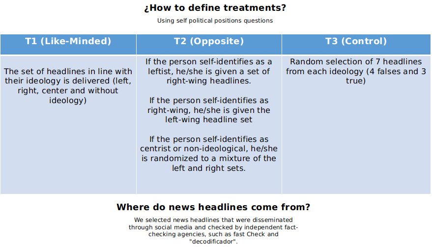
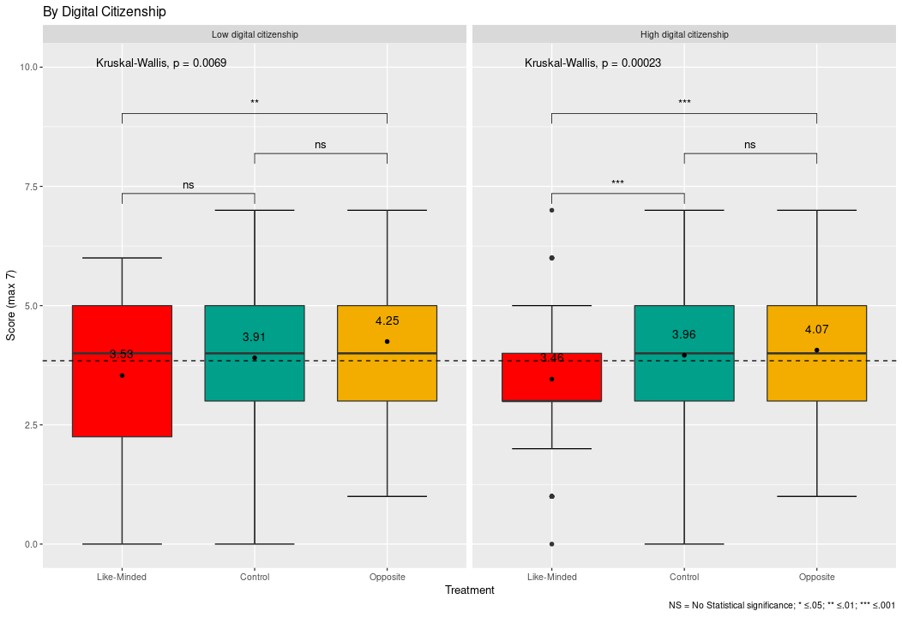

class:center, top, bg_karl


```{r setup, include=FALSE}
options(htmltools.dir.version = FALSE)
```
```{r xaringan-themer, include=FALSE, warning=FALSE, echo=FALSE, message=FALSE}
library(xaringanthemer)
style_mono_accent(
  base_color = "#23395b",
  header_font_google = google_font("Josefin Sans"),
  text_font_google   = google_font("Montserrat", "300", "300i"),
  code_font_google   = google_font("Fira Mono")
)
style_mono_light(base_color = "#23395b")
```
```{r, warning=FALSE, message=FALSE, echo=FALSE}
remotes::install_github('rstudio/chromote')

pacman::p_load(cowplot, ggplot2, tidyverse, dplyr, patchwork, kableExtra, MASS, ggpubr, fastDummies, renderthis)
```
```{css, echo = F}
.bg_karl {
  position: relative;
  z-index: 1;
}

.bg_karl::before {    
      content: "";
      background-image: url('https://blog.ida.cl/wp-content/uploads/sites/5/2020/11/ida-twitterFakenews-blog.png');
      background-size: cover;
      position: absolute;
      top: 0px;
      right: 0px;
      bottom: 0px;
      left: 0px;
      opacity: 0.15;
      z-index: -1;
}
```

### Trust in my Fake News, Scepticism about yours: Experimental Evidence on how Ideological Congruence and Echo Chambers alter Beliefs in Fake News

<br>
<br>

#### Francisco Villarroel (UDD/USACH, Chile) 
#### Denise Laroze (USACH, Chile)


<br>
<br>
<br>
```{r,echo=FALSE, fig.align='center', out.width="25%"}

knitr::include_graphics("beamer_presentation_files/logo_usach.png")
```


---
class: left, middle


.pull-left[
```{r, echo=FALSE, out.width="120%", fig.align='left'}


```

]

.pull-right[

<div style="text-align: justify">
Growing evidence suggests the existence of fake news is problematic (Sunstein, 2014; Lazer et.al, 2018), polarizing (Spohr, 2019; Osmundsen et. al., 2021) and erodes democracy (Lance & Livingston, 2018). Partisanship increase from this years and Eco chambers participants and digital activist promotes it.
</div>

<br>

<div style="text-align: justify">
Are echo chambers and group polarization causing problems in processing information to participate in discussion in the public space?
</div>

<br>

This leads us to analyze how people and their partisanship interpret the information circulating in social media.


]

---
background-image: url(beamer_presentation_files/logo_usach.png)
background-size: 110px
background-position: 97% 2%
class: left, middle

### First theories conducting this research


.pull-left[




]


.pull-right[

- More political homophilia, more reinforcement in the group's opinions.

- in Homophilic networks: "At the same time, political homophily may also insulate individuals from exposure to false or offensive information" (2)

- Homophily makes you "lose perspective" of politically opposing information.

]


---
class: inverse, centre, middle


## But ...


---
background-image: url(beamer_presentation_files/logo_usach.png)
background-size: 110px
background-position: 97% 2%
class: left, middle

### But fake news evidence said the opposite (although ambiguously)


<div style="text-align: justify">

.pull-left[

- First research we visited was that it was more cognitive laziness than ideological biases.

- Using a simple but robust method, they measure the level of belief in fake news by modulating the response times and self-reflection capacity of the classification.

- Other studies have shown other attributes such as not believing in science as relevant factors for believing in fake news.

]

</div>


.pull-right[


]

---
class: inverse, centre, middle


## So...

--

####Using the methodologies to the second group we try to test the first group hypothesis


---
background-image: url(beamer_presentation_files/logo_usach.png)
background-size: 110px
background-position: 97% 2%
class: center, middle

### Main Question

--
#### How partisanship affects when we have to distinguishing fake news from real news?

#### How does membership in echo chambers and digital citizenship affect this phenomenon?

---
background-image: url(beamer_presentation_files/logo_usach.png)
background-size: 110px
background-position: 97% 2%
class: left, middle

.pull-left[

## Concept of Echo chambers and Digital Citizenship

]

--

<div style="text-align: justify">

.pull-right[


- Friendship and resource network made up of like-minded people. Includes political homophily, social identity and confirmation bias (Boutyline et.al, 2017; Wollebæk et. al, 2019). Often produces by algorythms (Pariser, 2011)


- Type of political participation in digital platforms. includes technological skills, valuation of collective action in digital media and participation in them (Choi, M, 2016; Choi et.al, 2018; Chadwick, 2013; Castells, 2009). 
]

</div>

---
background-image: url(beamer_presentation_files/logo_usach.png)
background-size: 110px
background-position: 97% 2%
class: left, middle

.pull-left[

## ¿What do we know about the relationship between echo chambers and misinformation?

]

--

<div style="text-align: justify">

.pull-right[

- **Information bias**: Endemic consumption of information that is politically similar to one's own thinking and the distancing, rejection or impossibility of consuming information of different political thinking. (Currarini & Mengel, 2016; Halbestam & Knight, 2016)


- **Spread of Misinformation**: Those who belong to echo chambers spread information faster, generate rumors and reach audiences that do not directly access those rumors (Choi et. al. 2020)

]

</div>


---
background-image: url(beamer_presentation_files/logo_usach.png)
background-size: 110px
background-position: 97% 2%
class: left, top


## Hypothesis, we expect:

Following the political homophily effects (Wollebaek et.al, 2019; Boutyline & Willer, 2017; Ackland & Shorish, 2014)
#### <div style="text-align: justify"> 1) respondents will be less likely to accurately categorize fake and real news when asked to review news headlines with taking points associated with parties that oppose their political self-placement.
</div>


--

According to the same literature:
##### <div style="text-align: justify">1.a) no differences in accuracy across respondents with high and low levels of echo chamber membership </div>

--

Based on civic engament in social media literature (Gil de Zuñiga et.al, 2011, 2012; Castells, 2001,2009)
##### <div style="text-align: justify"> 1.b) respondents with higher levels of digital citizenship will be more likely to accurately categorize fake and real news than citizen with low levels of digital citizenship </div>


---
background-image: url(beamer_presentation_files/logo_usach.png)
background-size: 110px
background-position: 97% 2%
class:left, middle

# Methods

**Sample**

--

Online Survey Experiment (n= 690) with CESS Santiago de Chile's poll.

--

**Randomization**

Block randomization with Eco Chamber membership and levels of digital citizenship (both binaries)

--

**Experimental survey**

<div style="text-align: justify">
Socio-demographic characterization: Age range, gender, income, educational level, political ideology ("Left wing", "Right wing", "Center", "without ideology") + Fake news experiment
<div>

--
 
**Analysis**

<div style="text-align: justify">
Differences between averages by treatment, *Kruskall-Walis* and *Wilcoxon test*. And Regression models (balanced and unbalanced) with *Maximun Likehood* estimation
<div> 
 
---
background-image: url(beamer_presentation_files/logo_usach.png)
background-size: 110px
background-position: 97% 2%

## Experimental task

--

- Every participant received 7 headlines and we ask to evaluate if they're true or false

--

>_We will show you below 7 different headlines that are circulating in Social Media, some of which are true and others false. You will have to indicate if they are true or false._

>_(At the end of this survey you will be shown your results)._

>_How do you classify them?_

--

- if they're correct, them scoring 1. if there's incorrect, them scores zero.


- Maximun score is 7 and minimum is zero. 

--

## Validation process

--

- Two pre-test to evaluate the headline's relevance and difficulty


---
background-image: url(beamer_presentation_files/logo_usach.png)
background-size: 110px
background-position: 97% 2%
class: left, Top

## Eco Chamber membership Scale

- Using a recent validated scale<sup>*</sup> about reinforcement opinion in social media

- 7 items with 1 to 10 range por each item (total Range: 7 to 70)

- Low Eco Chamber Membership: 7 to 39
- High Eco Chamber Membership: 40 to 70

.footnote[[*] Kaakinen, M., Sirola, A., Savolainen, I., & Oksanen, A. (2020). Shared identity and shared
information in social media: Development and validation of the identity bubble
reinforcement scale. Media Psychology, 23(1).]

---
background-image: url(beamer_presentation_files/logo_usach.png)
background-size: 110px
background-position: 97% 2%
class: left, Top

## Digital Citizenship scale

- Using a Scale development by Choi<sup>*</sup> and reduced since 34 items to 14.

- Each item are with a 7 point scale (1 to 7). Total range: 14 to 98

- Low levels of digital citizenship: 14 to 62
- High levels of Digital citizenship: 63 to 98

.footnote[[*] Choi, M., Glassman, M., & Cristol, D. (2017). What it means to be a citizen in the internet age:
Development of a reliable and valid digital citizenship scale. Computers & Education, 107,
100-112.]

---
class: center, middle
background-image: url()


### Creating treatments




---
class: center, top


### Headlines examples


---
class: inverse, centre, middle


## Results


---
class: center, middle


---
class: center, middle

poner tabla de regresión


---
class: center, middle


---
Tabla de regresión con eco chambers

---
class: center, middle


---
class: center, middle


tabla de regresión con ciudadanía digital


---
class: center, middle


tabla de regresión con tratamientos más variables balanceadas juntas


---
background-image: url(beamer_presentation_files/logo_usach.png)
background-size: 110px
background-position: 97% 2%
class:left, top

## Discussion

- We find Evidence to intra-group biased new's consumption, supporting by others studies (eg: Osmundsen et.al, 2021; Pereira et.al, 2021)

- _**Motivated skepticism**_ (Taber & Lodge, 2006). Motivated skepticism is a concept used to describe the process by which people pay more attention to and are better informed about content that is opposed to their thinking, so as to be able to debate more fiercely with them.

- Researchers who had not considered this concept come to the same finding (eg. Allen et.al, 2021; Pennycook & Rand, 2019), and so do we.

- This invites us to look at political polarization from another angle: Is it a question of misunderstanding the other, or overestimating our own position?


---
class: inversed, center, middle
background-image: url(https://user-images.githubusercontent.com/163582/45438104-ea200600-b67b-11e8-80fa-d9f2a99a03b0.png)
background-size: 50px
background-position: 50% 85%

# ¡Thank You!

####.pull-left[Francisco Villarroel (fvillarroelr@udd.cl)

]

####.pull-right[Denise Laroze (denise.laroze@usach.cl)

]

<br>
<br>
<br>
<br>
<br>
<br>
<br>
<br>
<br>
<br>
<br>
<br>
<br>
<br>
<br>
This slide has created with [**xaringan**](https://github.com/yihui/xaringan) and [**XaringanThemer**](https://pkg.garrickadenbuie.com/xaringanthemer/index.html)

---
class: inverted, center, middle

# Appendix

---
background-image: url(beamer_presentation_files/regression_balanced.png)
background-size: contain
background-position: 50% 50%
class: middle, center

---
background-image: url(beamer_presentation_files/logo_usach.png)
background-size: 110px
background-position: 97% 2%
class: left, Top

## Some Insights about non-balances regression

- There a critical pint in the age-range. Younger people scores better. people to 45years+ tend to decrease the scoring.

- People with more education scoring better.

- There's no evidence of variations in political ideology and educational levels

---

**References:**

- Allen, J. N. L., Martel, C., & Rand, D. G. (2021). Birds of a feather don’t fact-check each other: Partisanship and the evaluation of news in Twitter’s Birdwatch crowdsourced fact-checking program [Preprint].

- Bago, B., Rand, D. G., & Pennycook, G. (2020). Fake news, fast and slow: Deliberation reduces belief in false (but not true) news headlines. Journal of Experimental Psychology: General, 149(8), 1608-1613. 

- Castells, M. (2009). Comunicación y poder. Alianza, Madrid.

- Choi, D., Chun, S., Oh, H., Han, J., & Kwon, T. “Taekyoung”. (2020). Rumor Propagation is Amplified by Echo Chambers in Social Media. Scientific Reports, 10(1), 310.

- Choi, M. (2016). A Concept Analysis of Digital Citizenship for Democratic Citizenship Education in the Internet Age. Theory & Research in Social Education, 44(4), 565-607.

- Choi, M., Cristol, D., & Gimbert, B. (2018). Teachers as digital citizens: The influence of individual backgrounds, internet use and psychological characteristics on teachers’ levels of digital citizenship. Computers & Education, 121, 143-161. 

--- 
class: left, top

- Currarini, S., & Mengel, F. (2016). Identity, homophily and in-group bias. European Economic Review, 90, 40-55. 

- Fu, G., & Zhang, W. (2016). Opinion formation and bi-polarization with biased assimilation and homophily. Physica A: Statistical Mechanics and Its Applications, 444, 700-712.

- Halberstam, Y., & Knight, B. (2016). Homophily, group size, and the diffusion of political information in social networks: Evidence from Twitter. Journal of Public Economics, 143, 73-88. 

- Osmundsen, M., Bor, A., Vahlstrup, P. B., Bechmann, A., & Petersen, M. B. (2021). Partisan Polarization Is the Primary Psychological Motivation behind Political Fake News Sharing on Twitter. American Political Science Review, 115(3), 999-1015. 

- Pennycook, G., & Rand, D. G. (2019). Lazy, not biased: Susceptibility to partisan fake news is better explained by lack of reasoning than by motivated reasoning. Cognition, 188, 39-50.

- Pereira, A., Harris, E., & Van Bavel, J. J. (2021). Identity concerns drive belief: The impact of partisan identity on the belief and dissemination of true and false news. Group Processes & Intergroup Relations.

---
class: left, top

- Taber, C. S., & Lodge, M. (2006). Motivated Skepticism in the Evaluation of Political Beliefs. American Journal of Political Science, 50(3), 755-769.

- Wollebæk, D., Karlsen, R., Steen-Johnsen, K., & Enjolras, B. (2019). Anger, Fear, and Echo
Chambers: The Emotional Basis for Online Behavior. Social Media + Society, 5(2).

---
background-image: url(https://raw.githubusercontent.com/francisco-vr/Homophily-and-Political-behaviour/main/Results/Tables/sample-descriptives.jpg)
background-size: contain
background-position: 50% 50%
class: top, center


